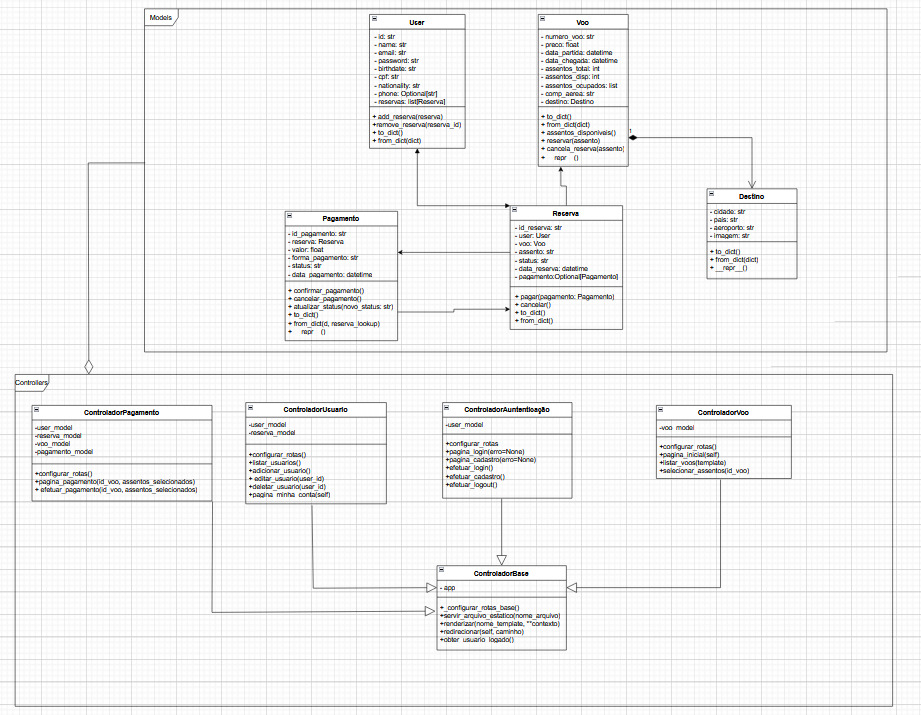

# ✈️ Decola-Brasil: Sistema de Gestão de Reservas Aéreas

 

Este projeto é uma aplicação web completa para gestão de reservas aéreas, desenvolvida como trabalho final para a disciplina de **Orientação a Objetos**. O sistema simula um portal de companhia aérea, permitindo que usuários se cadastrem, busquem voos, visualizem um mapa interativo de assentos, e realizem uma reserva completa, com todos os dados persistidos em um banco de dados SQLite.

## ✨ Funcionalidades Implementadas

O projeto conta com um fluxo de usuário completo, incluindo:

* **Autenticação de Usuários:** Sistema de cadastro, login e logout com gerenciamento de sessão via cookies.
* **Página Inicial Dinâmica:** Apresenta um carrossel interativo com os principais destinos.
* **Listagem de Voos:** Exibe os voos disponíveis em cards interativos que se expandem ao clicar para mostrar mais detalhes.
* **Mapa de Assentos Interativo:** Representação visual de uma aeronave, com indicadores de bico, asas e cauda. Permite a seleção de assentos disponíveis, com feedback de cores em tempo real e atualização do resumo da seleção.
* **Fluxo de Reserva e Pagamento:** Conduz o usuário desde a seleção de assentos até uma página de confirmação e checkout.
* **Perfil de Usuário:** Uma área logada onde o usuário pode visualizar seus dados pessoais e seu histórico de reservas.

## 📈 Melhorias Recentes

*   **Segurança Aprimorada (Hashing de Senhas):** Implementação de hashing de senhas utilizando `bcrypt` para garantir que as credenciais dos usuários sejam armazenadas de forma segura, protegendo contra acessos não autorizados.
*   **Persistência de Dados com Banco de Dados:** Migração da persistência de dados de arquivos JSON para um banco de dados relacional (SQLite), proporcionando maior robustez, integridade e escalabilidade para o armazenamento de informações de usuários, voos e reservas.

## 🚀 Tecnologias Utilizadas

* **Back-end:** Python 3
* **Microframework Web:** Bottle
* **Front-end:** HTML5, CSS3 (com Flexbox e Grid), JavaScript
* **Persistência de Dados:** SQLite (com SQLAlchemy ORM)
* **Controle de Versão:** Git e GitHub



## 🏛️ Arquitetura

O sistema foi desenvolvido seguindo o padrão **Model-View-Controller (MVC)**, com uma camada de **Serviço** para separar as responsabilidades:

* **Models:** Classes que representam as entidades do negócio (`Voo`, `User`, `Reserva`, etc.) e a lógica de acesso aos dados JSON.
* **Views:** Templates (`.tpl`) responsáveis pela apresentação dos dados ao usuário.
* **Controllers:** Classes que fazem a ponte entre os `Models` e as `Views`, controlando o fluxo da aplicação.

## ⚙️ Como Executar o Projeto

Siga os passos abaixo para rodar o projeto em seu ambiente local.

### Pré-requisitos

* [Python 3.10](https://www.python.org/downloads/) ou superior
* `pip` (gerenciador de pacotes do Python)

### Instalação e Execução

1.  **Clone o repositório:**
    ```bash
    git clone https://github.com/PArthur006/epf-decola.git
    cd epf-decola
    ```

2.  **(Recomendado) Crie e ative um ambiente virtual:**
    ```bash
    # Cria o ambiente
    python -m venv venv
    
    # Ativa o ambiente
    # No Linux/Mac:
    source venv/bin/activate
    # No Windows:
    # venv\Scripts\activate
    ```

3.  **Instale as dependências:**
    O projeto utiliza a biblioteca Bottle, listada no `requirements.txt`.
    ```bash
    pip install -r requirements.txt
    ```

4.  **Execute a aplicação:**
    ```bash
    python main.py
    ```

5.  Abra seu navegador e acesse: `http://localhost:8080`

## 🧑‍💻 Equipe

* **([Pedro Arthur Rodrigues](https://github.com/PArthur006)):** Responsável pelo desenvolvimento Front-end, arquitetura dos Controllers, lógica de persistência e interatividade das páginas.
* **([Maria Luana Lopes](https://github.com/MLuana725))** Responsável pelo desenvolvimento Back-end e modelagem de dados.

---
*Este projeto foi desenvolvido para a disciplina de Orientação a Objetos (2025.1) do Professor Lucas Boaventura, a partir de um template educacional.*